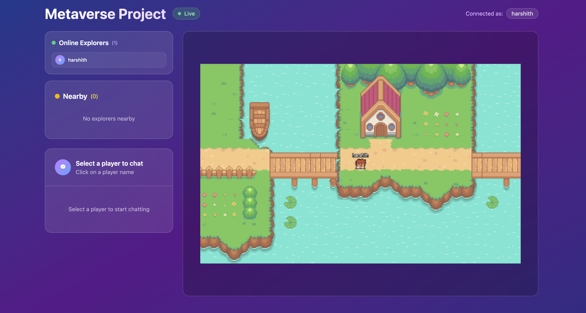

# Metaverse Project

This is a real-time multiplayer metaverse project built with React, Phaser, Node.js, and Socket.IO.

## Features

*   Real-time player movement and synchronization.
*   WASD and Arrow key controls.
*   Player chat functionality.
*   Collision detection.

## Screenshots

### Login Screen


### Metaverse View



## Technologies Used

*   **Frontend:** React, Phaser, Vite, TypeScript, Tanstack Query, Tanstack Router
*   **Backend:** Node.js, Express, Socket.IO
*   **Deployment:** Docker, Docker Compose, Railway

## Local Development Setup

To run this project locally, you will need Node.js, npm, and Docker installed on your machine.

1.  **Clone the repository:**
    ```bash
    git clone <your-repo-url>
    cd Metaverse
    ```

2.  **Install Frontend Dependencies (for local development without Docker):**
    ```bash
    cd frontend
    npm install
    cd ..
    ```

3.  **Install Backend Dependencies (for local development without Docker):**
    ```bash
    cd server
    npm install
    cd ..
    ```

4.  **Run Locally (without Docker):**
    *   Start the backend server:
        ```bash
        cd server
        npm start
        ```
    *   In a new terminal, start the frontend development server:
        ```bash
        cd frontend
        npm run dev
        ```
    *   Access the frontend at `http://localhost:5173` (Vite's default port).

## Running with Docker Locally

Ensure Docker Desktop is running on your machine.

1.  **Build and Run Services:**
    ```bash
    docker compose up --build
    ```
    This command will build the Docker images for both your frontend and backend, and then start the containers.

2.  **Access the Application:**
    *   **Frontend:** Open your browser and go to `http://localhost:8080`
    *   **Backend API/Socket:** The backend will be accessible at `http://localhost:5000`

## Deployment to Railway

This project is configured for deployment to Railway using Docker.

1.  **Push your code to a GitHub repository.**

2.  **Create Backend Service on Railway:**
    *   In your Railway project, click **New → Deploy from GitHub repo**.
    *   Select your repository.
    *   Go to the service's **Settings** tab, then **Variables**.
    *   Add:
        *   **Name:** `RAILWAY_DOCKERFILE_PATH`
        *   **Value:** `server/Dockerfile`
    *   Copy the public URL Railway assigns to this service (e.g., `https://your-backend-name.up.railway.app/`).

3.  **Create Frontend Service on Railway:**
    *   In your Railway project, click **New → Deploy from GitHub repo**.
    *   Select the **same repository**.
    *   Go to this service's **Settings** tab, then **Variables**.
    *   Add:
        *   **Name:** `RAILWAY_DOCKERFILE_PATH`
        *   **Value:** `frontend/Dockerfile`
    *   Add:
        *   **Name:** `VITE_SERVER_URL`
        *   **Value:** The public URL of your backend service (e.g., `https://your-backend-name.up.railway.app/`).

4.  **Access Live Application:** Once both services are deployed, access your application via the public URL of your frontend service.

## Troubleshooting

*   **`package.json: not found` error during Docker build:** Ensure your `Dockerfile`s have `COPY server/package.json ./` (or `frontend/package.json`) if your build context is the repository root.
*   **Frontend connecting to `localhost:5000` in production:** Double-check `VITE_SERVER_URL` environment variable on your frontend service in Railway. Ensure it's spelled correctly and has the full public URL of your backend. Remember to redeploy the frontend after setting/changing this variable.
*   **Refresh causes 404:** This is fixed by the Nginx configuration in `frontend/nginx.conf`. Ensure your `frontend/Dockerfile` is correctly copying this file.

---
